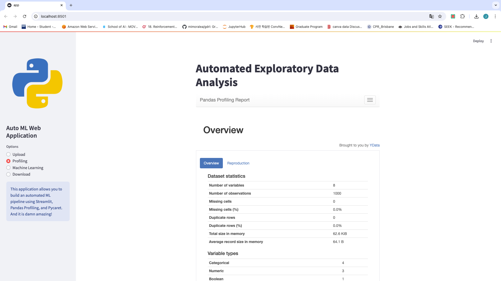
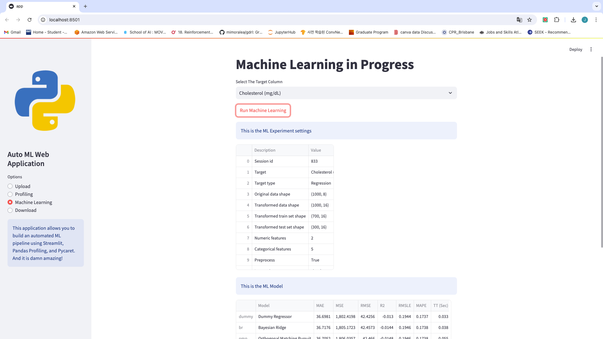
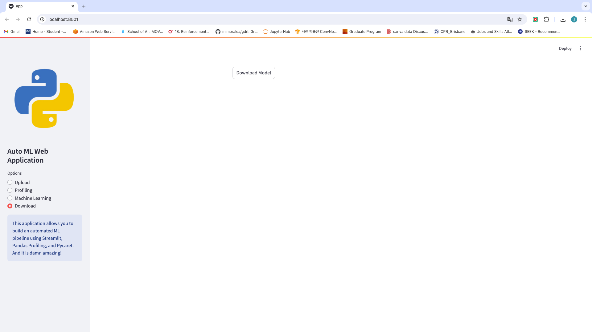

## This is the Automated Machine Learning Web Application
## Using Python Streamlit

Run the python file with 
```
streamlit run app.py
```
<p>

<h3>
First, upload the file to the web server
</h3>

<h3>
Once it's done, click Profiling on the options menu, then it will automatically generate the exploratory data analysis of the data you have uploaded
</h3>

<h3>
After it generates the Exploratory data analysis, then go to Machine Learning option and select the target column and click run machine learning to see the results
</h3>

<h3>
You can also download the best model from the Machine Learning, by go to Download option and click Download Model
</h3>
</p>